# Atmosphere

For the spectral synthesis PySME needs a model atmosphere
to perform the radiative transfer in. PySME does not come
with a set of atmospheres in each distribution but instead
uses the LFS (See [lfs](lfs.md)) to fetch only the required
model atmosphere when run.

If you want to provide your own model atmosphere file, it should be present in `~/.sme/atmospheres/`.

Each atmosphere model file describes a grid of models, on
which we then linearly interpolate to the desired stellar parameters.
Sometimes we dare extrapolate from this grid as well, but in that case,
we always show a warnning.

Note that the atmosphere also contains a seperate set of stellar
parameters, which is usually the same as that of the sme structure,
but can be different, if for example the atmosphere is embedded, i.e.
fixed, or has not been calculated yet.

The atmopshere object has the following fields:

|Field name|Description|Allowed values or [Unit]|
|:---:|:---:|:---:|
|`teff`|Effective Temperature|[K]|
|`logg`|Surface Gravity|[log(cgs)]|
|`monh`|Metallicity||
|`abund`|The individual abundances (see [abund](#abund))||
|`vsini`|Projected Rotational velocity|[km/s]|
|`vmic`|Microturbulence velocity|[km/s]|
|`vmac`|Macroturbulence velocity|[km/s]|
|`source`|Filename of the atmosphere grid|see [lfs](lfs.md)|
|`depth`|The depth scale to use for calculations.|`RHOX` or `TAU`|
|`interp`|The depth scale to use for interpolation.|`RHOX` or `TAU`|
|`geom`|The geometry of the atmosphere.|Plane Parallel `'PP'` or Spherical `'SPH'`|
|`method`|The method to use for interpolation|`'grid'` for a model grid or `'embedded'` if only a single atmosphere is given|
|`rhox`|Mass column at each tabulated depth in the atmosphere|[$\mathrm{g~cm^{-2}}$]|
|`tau`|Continuum optical depth at each tabulated depth in the atmosphere||
|`temp`|Temperature at each tabulated depth in the atmosphere|[K]|
|`xna`|Atomic number density (including atomic components of molecules) at each tabulated depth in the atmosphere.|[$\mathrm{cm^{-3}}$]|
|`xne`|Electron number density at each tabulated depth in the atmosphere|[$\mathrm{cm^{-3}}$]|
|`rho`|Mass density at each tabulated depth in the atmosphere.|[$\mathrm{g~cm^{-3}}$]|
|`height`|Height above or below `radius` at each tabulated depth in a spherical atmosphere.|[cm]|
|`radius`|Stellar radius corresponding to `height` of zero in a spherical atmosphere|[cm]|
|`vturb`|Turbulent velocity used to generate the atmosphere|[km/s]|
|`lonh`|Ratio of mixing length to pressure scale height (`/H) used to generate the atmosphere.||
|`wlstd`|Wavelength for continuum optical depth scale.|Å, Default value: 5000Å|
|`opflag`|Flags that indicate whether to enable various opacity packages during the radiative transfer calculation||

## Grid atmospheres 

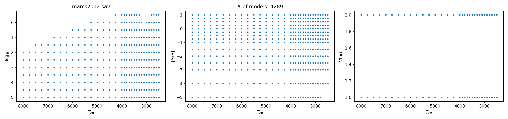
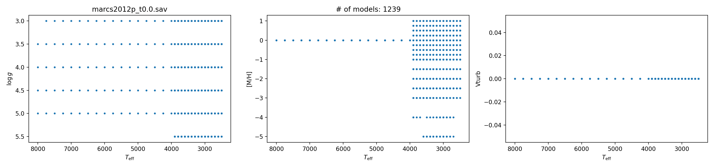
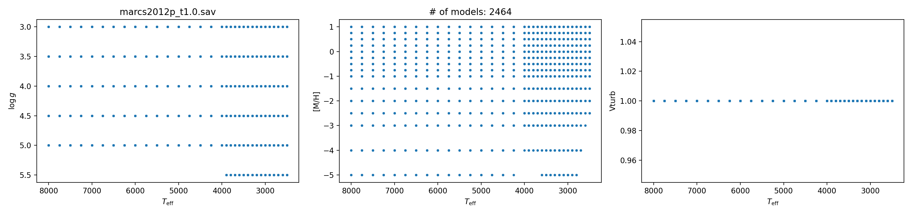
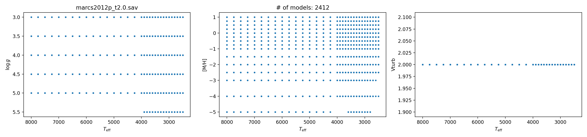
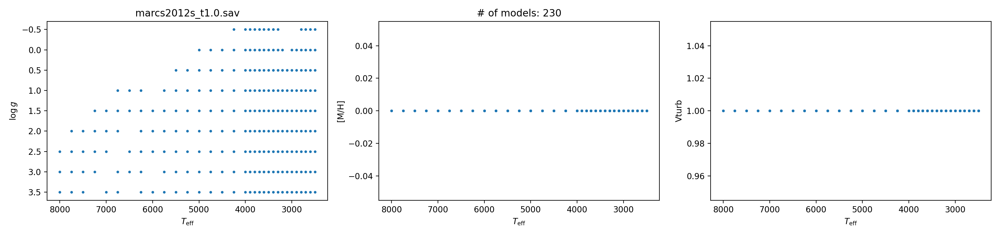
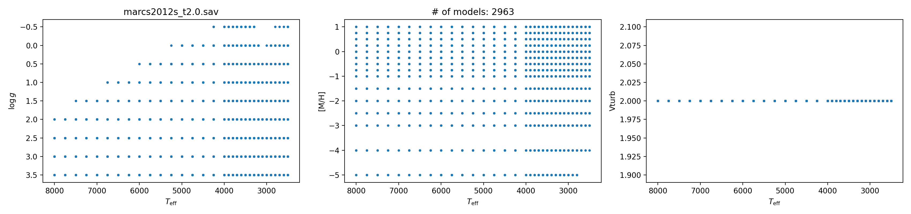
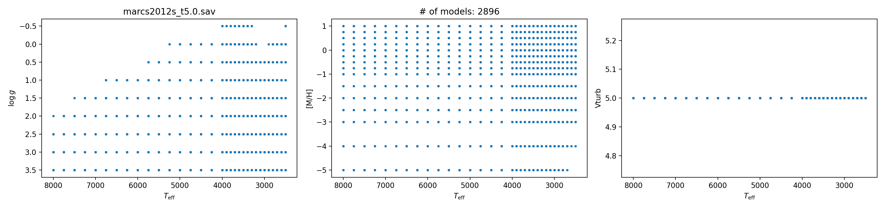
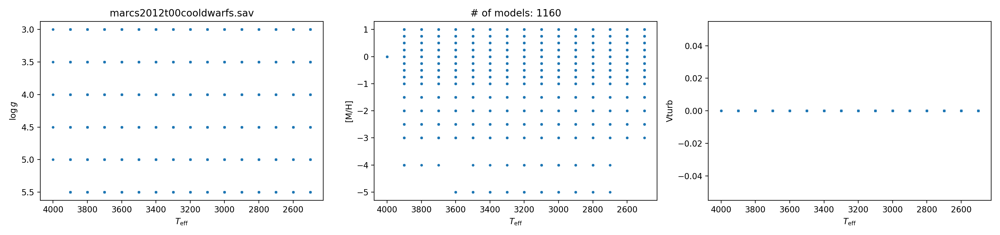
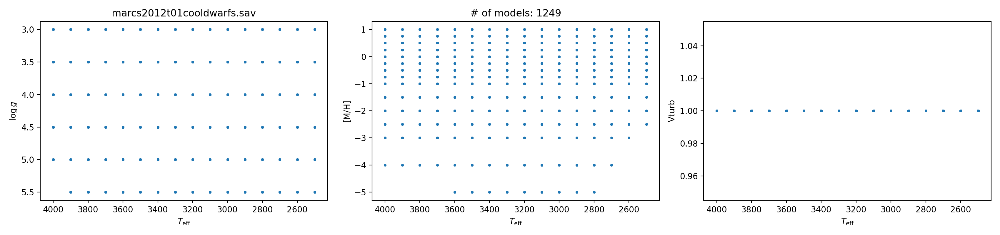
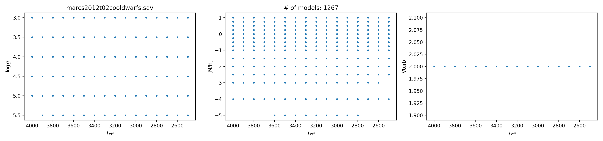
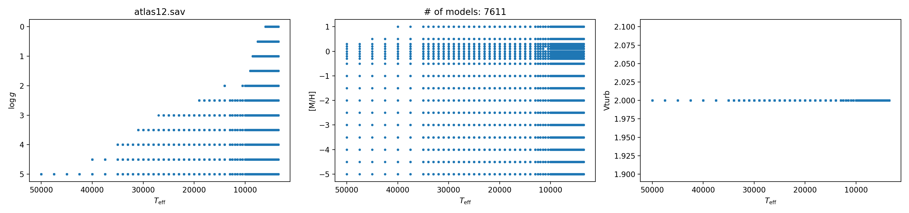
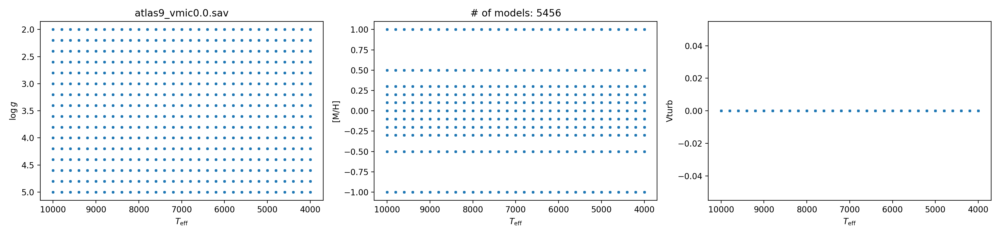
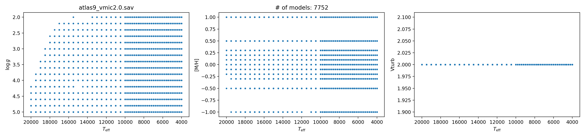
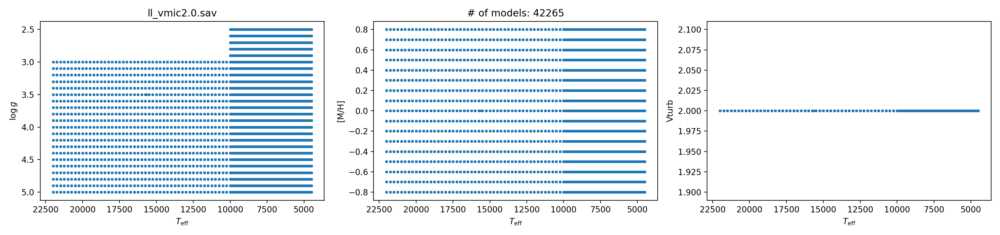